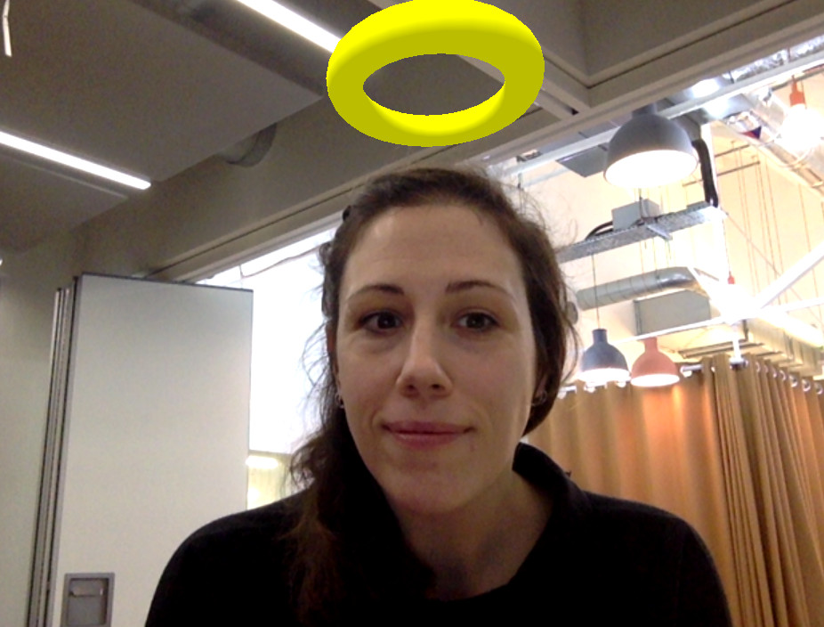

# We are all Saints

> An AR experiment using computer vision in the browser.

Read more about this [augmented reality experiment](http://gu.illau.me/posts/augmented-reality-computer-vision/)
on my personal blog.

(Say Hello to Sarah, the amazing producer of [MozFest](https://mozillafestival.org/)!)

## How?

I use a face detection script on the output of the camera to determine the 
position of faces in a virtual 3D space.

A virtual halo is positioned on top every faces detected.

Finally A-Frame is used to display the virtual environment on top of the camera
video.

## Bug?

Sometime the detection stops working and the halo gets stuck in the middle of 
the screen. In this case just refresh the browser.

## Why a halo?

I want to encourage you to see the good in yourself and others.
Assume the best from people and your life will be enlightened.
